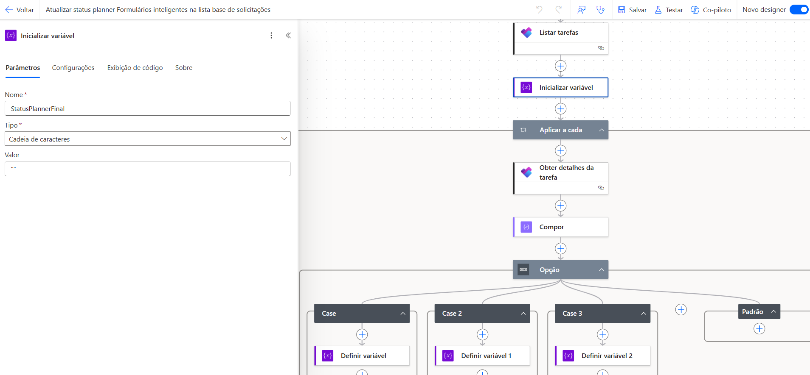
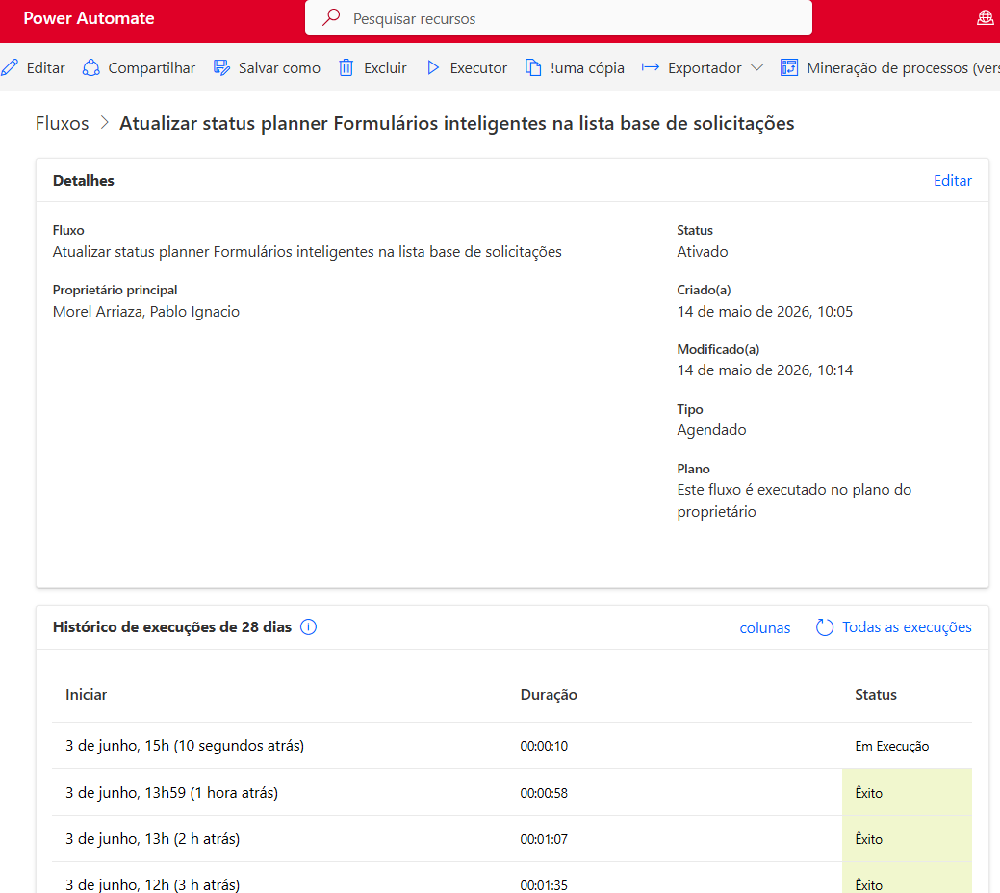

# ⚙️ Automação de Atualização de Status de Projetos (Planner + SharePoint)

## 🎯 Objetivo
Automatizar a atualização diária do status das tarefas associadas aos projetos, garantindo sincronização entre o Planner e a lista consolidada de projetos no SharePoint.

## 🛠 Ferramentas
- Power Automate
- SharePoint Lists
- Planner

## 🧠 Contexto
Projeto desenvolvido para integrar o acompanhamento operacional das tarefas no Planner com a base consolidada de projetos utilizada para controle e análise.

A automação garante que os status das tarefas sejam atualizados automaticamente na lista SharePoint, eliminando a necessidade de atualização manual e garantindo consistência das informações.

## 🔄 Fluxo automatizado
- Disparo automático (execução recorrente diária)
- Leitura da lista consolidada de projetos no SharePoint
- Recuperação do ID da tarefa associado a cada projeto
- Consulta das tarefas no Planner
- Captura do status atualizado de cada tarefa
- Tratamento das informações (Compose e variáveis)
- Aplicação de lógica condicional para classificação do status
- Atualização automática do status na lista SharePoint

## 📊 Benefícios
- Eliminação de atualizações manuais de status
- Sincronização automática entre Planner e SharePoint
- Maior confiabilidade nas informações dos projetos
- Visão atualizada para gestão e acompanhamento
- Padronização dos status das atividades

## 🧠 Lógica aplicada
- Execução recorrente programada (daily)
- Loop “Aplicar a cada” para percorrer os projetos
- Uso de ações do Planner para obter detalhes das tarefas
- Estruturação dos dados com Compose
- Lógica condicional (Switch/Case) para mapeamento de status
- Atualização dinâmica de itens no SharePoint

## 🚀 Desafios enfrentados
- Garantia da correspondência entre ID da tarefa e projeto
- Tratamento de diferentes status do Planner
- Padronização dos status na lista consolidada
- Performance no processamento de múltiplos registros

## ✅ Soluções aplicadas
- Uso do ID da tarefa como chave de integração
- Implementação de lógica condicional para padronização
- Estruturação do fluxo com processamento em loop
- Atualização automatizada e contínua dos dados

## 📷 Imagens

  

