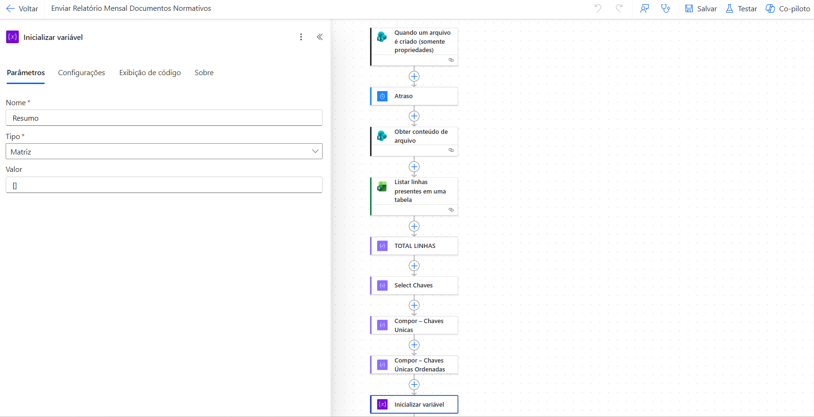
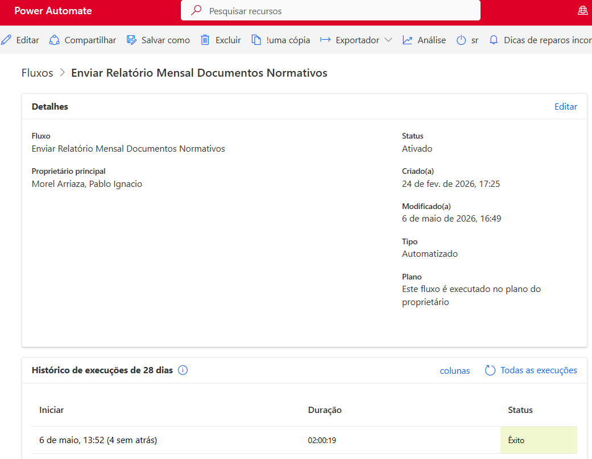
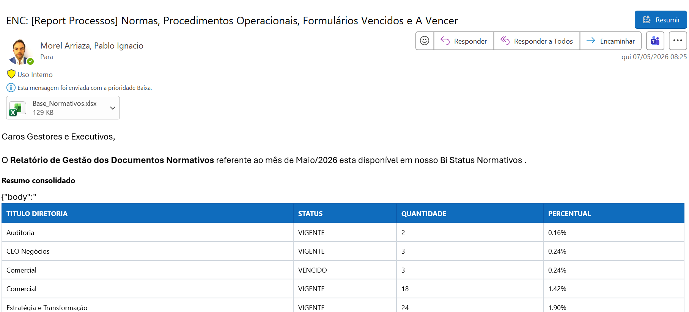

# ⚙️ Automação de Monitoramento de Documentos Normativos (SharePoint + Excel + Email)

## 🎯 Objetivo
Automatizar o monitoramento e comunicação dos documentos normativos vigentes e a vencer, garantindo visibilidade periódica para as diretorias e pontos focais da organização.

## 🛠 Ferramentas
- Power Automate
- SharePoint
- Excel Online
- Outlook

## 🧠 Contexto
Projeto desenvolvido para automatizar o processo de acompanhamento dos documentos normativos armazenados no SharePoint.

O fluxo é acionado automaticamente a partir da criação de novos arquivos ou via execução programada, consolidando as informações e gerando relatórios estruturados para envio mensal aos responsáveis.

## 🔄 Fluxo automatizado
- Gatilho ao detectar novo arquivo no SharePoint ou execução periódica
- Leitura e processamento dos documentos normativos
- Classificação dos documentos:
  - Vigentes
  - A vencer
- Geração automática de arquivo Excel consolidado contendo:
  - Lista completa de documentos por diretoria
  - Status atualizado (vigente / a vencer)
- Criação de tabela resumo com os principais indicadores
- Envio automático de e-mail para os pontos focais contendo:
  - Arquivo Excel anexado
  - Tabela resumo inserida diretamente no corpo do e-mail

## 📊 Benefícios
- Automação do controle de documentos normativos
- Eliminação de tarefas manuais de consolidação
- Comunicação padronizada e periódica
- Maior controle de prazos e vencimentos
- Visibilidade centralizada para as diretorias

## 🧠 Lógica aplicada
- Gatilho baseado em eventos no SharePoint
- Processamento e filtragem de documentos
- Criação dinâmica de tabelas no Excel
- Construção de conteúdo HTML para envio no corpo do e-mail
- Automação de envio recorrente

## 🚀 Desafios enfrentados
- Consolidação de informações de múltiplos documentos
- Padronização de dados para geração do relatório
- Construção dinâmica da tabela resumo para e-mail
- Garantia de atualização correta dos status de vencimento

## ✅ Soluções aplicadas
- Estruturação do fluxo com etapas de processamento e consolidação
- Criação de lógica para classificação dos documentos
- Geração automatizada de arquivo Excel estruturado
- Desenvolvimento de template de e-mail com tabela dinâmica
- Implementação de envio automático mensal

## 📷 Imagens

  

