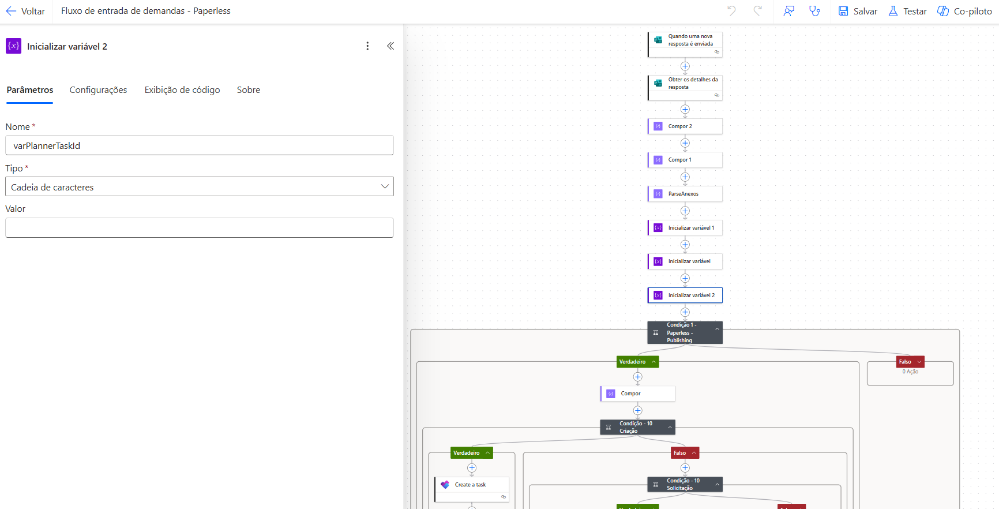
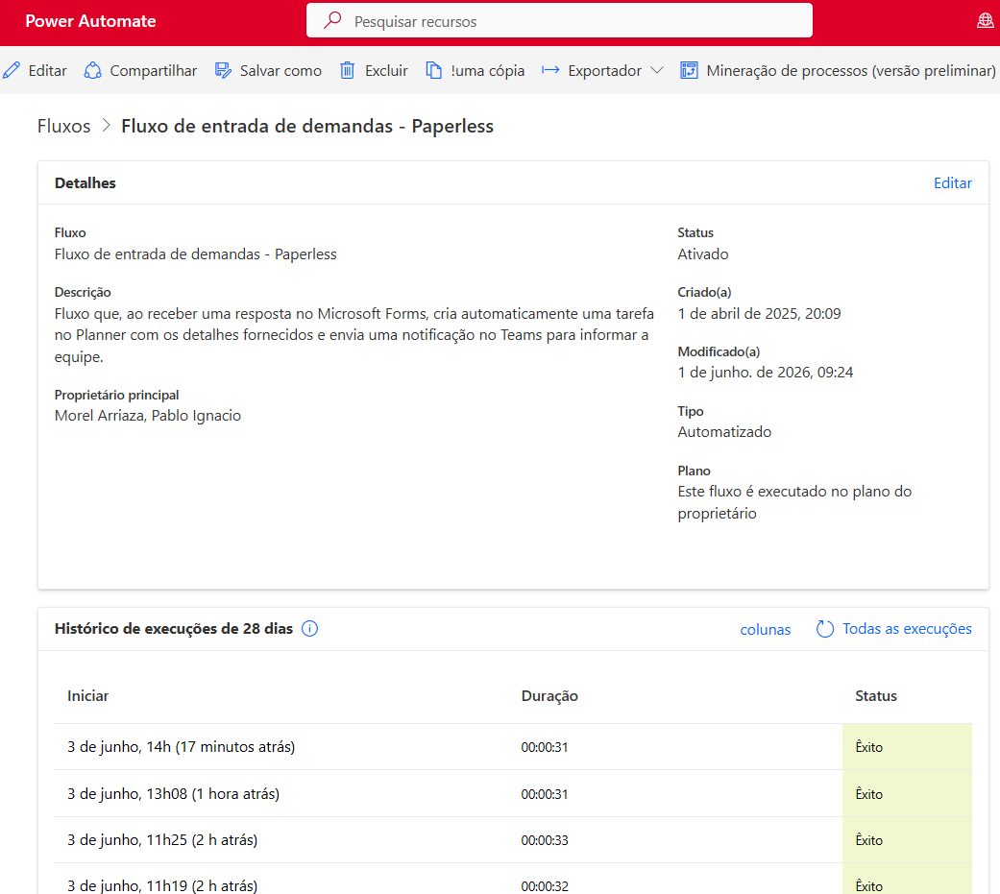

# ⚙️ Automação de Solicitações com Power Automate (Forms + Planner + Teams)

## 🎯 Objetivo
Automatizar o fluxo de recebimento e gestão das solicitações enviadas via Microsoft Forms, garantindo a criação automática de tarefas, atribuição de responsáveis e comunicação imediata com a equipe.

## 🛠 Ferramentas
- Power Automate
- Microsoft Forms
- Planner
- Microsoft Teams

## 🧠 Contexto
Projeto desenvolvido para eliminar atividades manuais no processo de recebimento de solicitações e garantir rastreabilidade completa das demandas.

A automação integra diferentes ferramentas do ecossistema Microsoft, conectando a entrada da solicitação até a sua distribuição operacional para a equipe.

## 🔄 Fluxo automatizado
- Disparo automático ao receber uma nova resposta no Microsoft Forms
- Captura dos dados completos da solicitação
- Tratamento e estruturação das informações (Compose e variáveis)
- Aplicação de condições para classificação da demanda
- Criação automática de tarefa no Planner
- Atribuição do responsável de acordo com regras definidas
- Envio de notificação no Microsoft Teams com todos os dados da solicitação

## 📊 Benefícios
- Eliminação de entrada manual de dados
- Criação automática de tarefas operacionais
- Comunicação imediata com a equipe via Teams
- Maior controle e rastreabilidade das solicitações
- Padronização do processo de gestão de demandas

## 🧠 Lógica aplicada
- Uso de gatilho baseado em resposta do Forms
- Estruturação de dados com ações “Compor” e variáveis
- Aplicação de condições (If / Condition) para direcionamento das solicitações
- Criação dinâmica de tarefas no Planner
- Integração com Teams para comunicação automatizada

## 🚀 Desafios enfrentados
- Mapeamento correto dos campos do formulário
- Tratamento de diferentes tipos de solicitação
- Definição de regras de atribuição automática
- Garantia de consistência dos dados enviados

## ✅ Soluções aplicadas
- Estruturação do fluxo com etapas sequenciais bem definidas
- Uso de variáveis para consolidação dos dados da solicitação
- Implementação de lógica condicional para classificação das demandas
- Automatização da comunicação via Teams para visibilidade imediata

## 📷 Imagens

  

