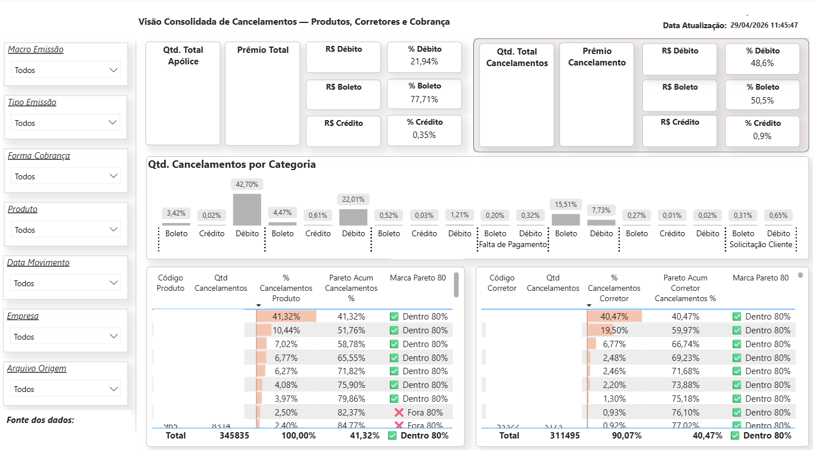
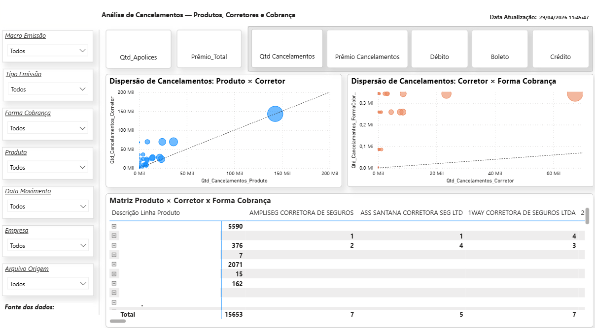

# 📊 Dashboard de Análise de Cancelamentos

## 🎯 Objetivo
Analisar o comportamento dos cancelamentos de apólices, permitindo identificar padrões por produto, corretor e forma de pagamento, com foco na identificação de causas e oportunidades de melhoria.

## 🛠 Ferramentas
- Power BI
- Power Query (M)
- DAX
- Arquivo CSV (extraído de CRM)

## 🧠 Contexto
Projeto desenvolvido com base em dados extraídos de um sistema CRM, com o objetivo de entender os fatores que impactam os cancelamentos de apólices.

Os dados foram tratados, estruturados e analisados para fornecer uma visão estratégica e analítica sobre o comportamento dos cancelamentos.

Por questões de confidencialidade, os dados apresentados foram adaptados ou mascarados.

## 🔗 Arquitetura e Fontes de Dados
- Arquivo CSV contendo dados de apólices e cancelamentos
- Informações de produtos e corretores
- Dados de forma de pagamento associados aos cancelamentos

## 📊 Principais análises
- Quantidade total de apólices e cancelamentos
- Cancelamentos por produto
- Cancelamentos por corretor
- Cancelamentos por meio de pagamento (boleto, débito, crédito)
- Análise comparativa entre produto e corretor

## 📈 Análises avançadas
- Curva de Pareto (80/20) de cancelamentos por:
  - Produto
  - Corretor
- Identificação dos principais responsáveis pelo volume de cancelamentos

## 🔍 Visão analítica
- Gráfico de dispersão:
  - Cancelamentos por Produto x Corretor
  - Cancelamentos por Corretor x Forma de pagamento
- Identificação de padrões e outliers nos cancelamentos

## 🧠 Modelagem de dados
Modelo estruturado considerando:
- Fato: Cancelamentos / Apólices
- Dimensões:
  - Produto
  - Corretor
  - Forma de pagamento
  - Calendário

## ⚙️ Transformações (Power Query - M)

Date.FromText(
    Text.Start([Data Movto],4) & "-" &
    Text.End([Data Movto],2) & "-01"
)

if [Motivo Endosso] = null then 0
  else if Text.Contains([Macro_Emissão], "Canc", Comparer.OrdinalIgnoreCase) 
       or Text.Contains([Macro_Emissão], "Cancel", Comparer.OrdinalIgnoreCase)
  then 1 else 0

  
## 📐 Medidas DAX

% Apolices = 
DIVIDE(
    [Qtd_Numero_Pagamentos],
    CALCULATE(
        [Qtd_Numero_Pagamentos],
        ALL ( Consolidado[Forma Cobrança] )
    ),
    0
)

Pareto Acum Cancelamentos % = 
VAR Cancel = [Qtd Cancelamentos]
VAR r = [Rank_Produto_Cancel]
VAR acumulado =
    CALCULATE(
        [Qtd Cancelamentos],
        FILTER(
            ALL(Consolidado[Código Produto]),
            [Rank_Produto_Cancel] <= r
        )
    )
RETURN
IF(
    Cancel <= 0 || ISBLANK(Cancel),
    BLANK(),
    DIVIDE(acumulado, [Total Cancelamentos Todos Produtos])
)

Rank_Corretor_Cancel = 
VAR Cancel = [Qtd Cancelamentos]
RETURN
IF(
    Cancel <= 0 || ISBLANK(Cancel),
    BLANK(),
    RANKX(
        FILTER(
            ALL(Consolidado[Código Corretor]),
            CALCULATE([Qtd Cancelamentos]) > 0
        ),
        [Qtd Cancelamentos],
        ,
        DESC,
        DENSE
    )
)

## 📷 Imagens

  

