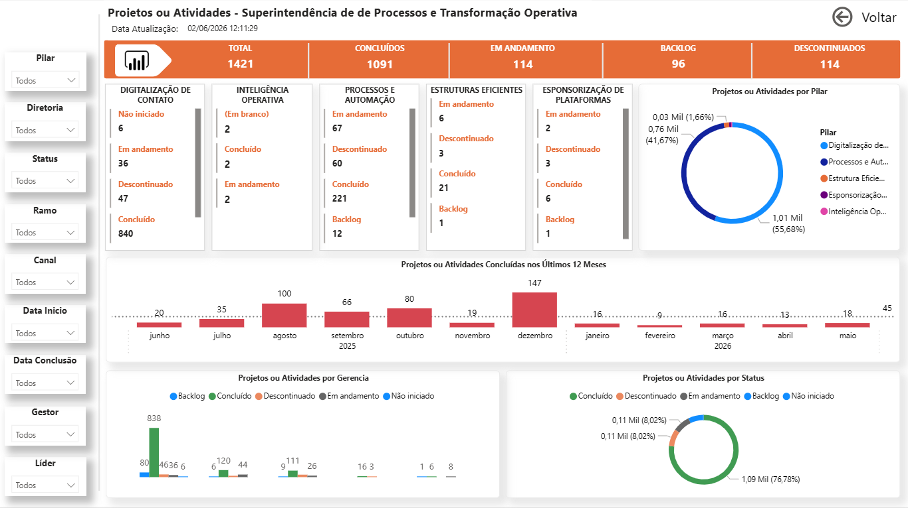
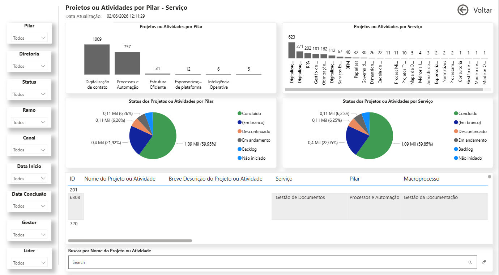
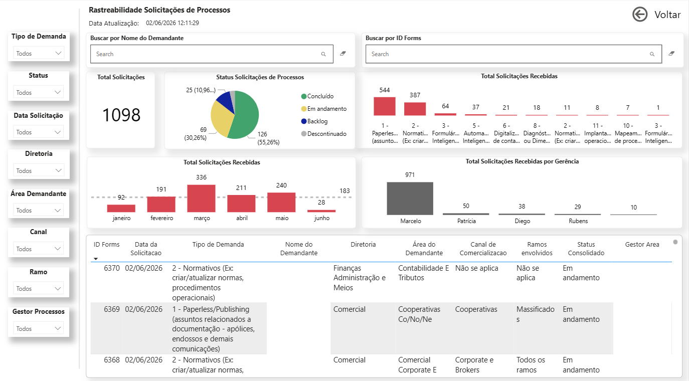

# 📊 Dashboard de Gestão de Projetos de Processos

## 🎯 Objetivo
Monitorar e controlar a execução dos projetos das quatro gerências de processos, permitindo visão consolidada de status, priorização e evolução das iniciativas.

## 🛠 Ferramentas
- Power BI
- Power Query (M)
- DAX
- SharePoint Lists
- Excel

## 🧠 Contexto
Projeto desenvolvido em ambiente corporativo com foco na governança e acompanhamento dos projetos de processos.

O dashboard integra informações provenientes de múltiplas fontes, garantindo rastreabilidade completa das solicitações recebidas por meio do formulário de processos.

Por questões de confidencialidade, os dados apresentados foram adaptados ou mascarados.

## 🔗 Arquitetura e Fontes de Dados
- Listas de SharePoint de cada gerência
- Planilhas Excel
- Formulário de entrada de demandas de processos
- Vinculação dos projetos aos macroprocessos da organização

## 📊 Principais análises
- Status dos projetos por gerência
- Classificação por tipo de serviço
- Acompanhamento por diretorias
- Evolução das demandas ao longo do tempo
- Rastreamento das solicitações desde a entrada até a conclusão

## 🧠 Modelagem de dados
Modelo estruturado considerando:
- Fato: Projetos / Solicitações
- Dimensões:
  - Gerência
  - Tipo de serviço
  - Diretoria
  - Macroprocessos
  - Calendário

## 📐 Medidas DAX

Solicitações Backlog = 
CALCULATE(
    [Total Solicitações],
    'Base Solicitações de Processos'[Status_Consolidado] = "Backlog"
)

Backlog =
VAR TotalBacklog =
    CALCULATE(
        COUNT('Lista_Unificada'[Status Projeto]),
        'Lista_Unificada'[Status Projeto] = "Backlog"
    )
RETURN
IF(
    ISBLANK(TotalBacklog),
    0,
    TotalBacklog
)

Total Solicitações = COUNT('Base Solicitações de Processos'[ID Forms])

## 📷 Imagens

  

