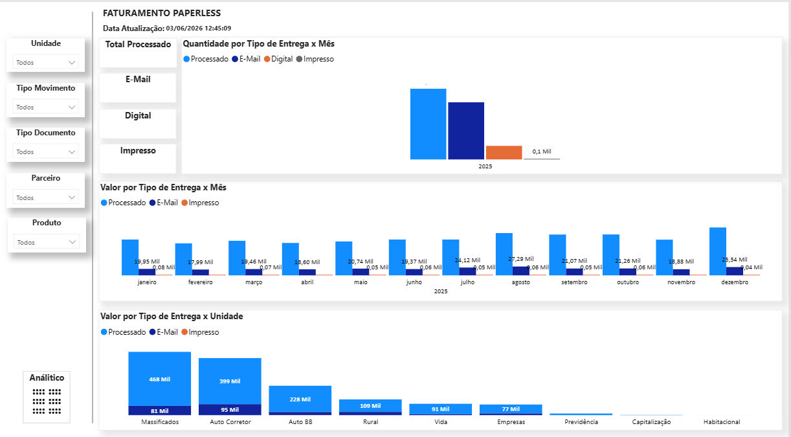

# 📊 Dashboard de Faturamento e Processamento Paperless

## 🎯 Objetivo
Monitorar e controlar o volume e os valores dos arquivos de apólices processados por fornecedor, garantindo visibilidade sobre a produção e o faturamento do serviço de digitalização e envio aos segurados.

## 🛠 Ferramentas
- Power BI
- Power Query (M)
- DAX
- Script de consolidação (Python)
- Arquivos CSV

## 🧠 Contexto
Projeto desenvolvido para acompanhar o desempenho operacional e financeiro do fornecedor responsável pela digitalização das apólices e envio por e-mail aos segurados.

Os dados são recebidos em múltiplos arquivos CSV enviados periodicamente pelo fornecedor, contendo informações de volume processado, tipos de entrega e valores faturados.

Para viabilizar a análise, foi desenvolvido um script responsável por processar, consolidar e padronizar todas as bases de dados antes da ingestão no Power BI.

Por questões de confidencialidade, os dados apresentados foram adaptados ou mascarados.

## 🔗 Arquitetura e Fontes de Dados
- Arquivos CSV enviados pelo fornecedor contendo:
  - Quantidade de arquivos processados
  - Tipos de entrega (E-mail, Digital, Impresso)
  - Valores do serviço prestado
- Script de consolidação para unificação das bases
- Base consolidada consumida pelo Power BI

## 📊 Principais análises
- Volume total de arquivos processados
- Quantidade de apólices por tipo de entrega:
  - E-mail
  - Digital
  - Impresso
- Evolução mensal do volume processado
- Análise de valores faturados por período
- Comparativo entre volume e valor por tipo de entrega

## 📈 Análises estratégicas
- Monitoramento da produtividade do fornecedor
- Avaliação de custos por volume processado
- Identificação de variações mensais no faturamento
- Análise da distribuição dos volumes por unidade / produto

## 🔍 Visão analítica
- Gráficos de barras:
  - Quantidade por tipo de entrega x mês
  - Valor por tipo de entrega x mês
- Análise por unidade (distribuição do volume processado)
- Filtros dinâmicos por:
  - Unidade
  - Tipo de movimento
  - Produto
  - Período

## 🧠 Modelagem de dados
Modelo estruturado considerando:
- Fato: Processamento de apólices
- Dimensões:
  - Data
  - Tipo de entrega
  - Unidade
  - Produto
 
## ⚙️ Transformações (Power Query - M)

Text.Middle(
    [Nome da Origem],
    Text.PositionOf([Nome da Origem], "_", Occurrence.Last) + 1,
    7
)

Date.EndOfMonth([#"Mes/Ano arquivo"])

DateTimeZone.SwitchZone([Column1], -3)

## 🐍 Script de Consolidação (Python)

Para possibilitar a análise dos dados, foi desenvolvido um script responsável por:

- Processar múltiplos arquivos CSV enviados pelo fornecedor
- Consolidar os dados em uma base única
- Padronizar estrutura e nomenclaturas
- Preparar os dados para consumo no Power BI

O script pode ser encontrado neste repositório:
📁 script_consolidacao.ipynb

### Exemplo do Script

import os
import pandas as pd
pasta = 
arquivos = [f for f in os.listdir(pasta) if f.endswith(".xlsx")]

mapa_unidade = {
    "CAVD": "Auto BB",
    "CAVE": "Auto BB",
    "UBMS": "Auto BB",
    "NAUTICO": "Empresas"
}

mapa_documento = {
    "7 - CARNE DE RESSARCIMENTO": "Carnê de Ressarcimento", 
    "8 - CARTA DE AVISO DE RENOVAÇÃO": "Carta de Aviso de Renovação", 
    "1 - ADESÃO - SEGURO NOVO": "Ap. e End.", 
    "550 - 05 Exclusão de Risco por Sinistro": "Ap. e End."
}

mapa_parceiro_composto = {
    "UBMS|0001-NÃO INFORMADO": "Brasil Veiculos",
    "UBMS|0010-ESTILO": "Brasil Veiculos",
    "VIMA|001-MAPFRE": "MAPFRE"
}

dfs = []
resumo_arquivos = []

## 📷 Imagens

  

