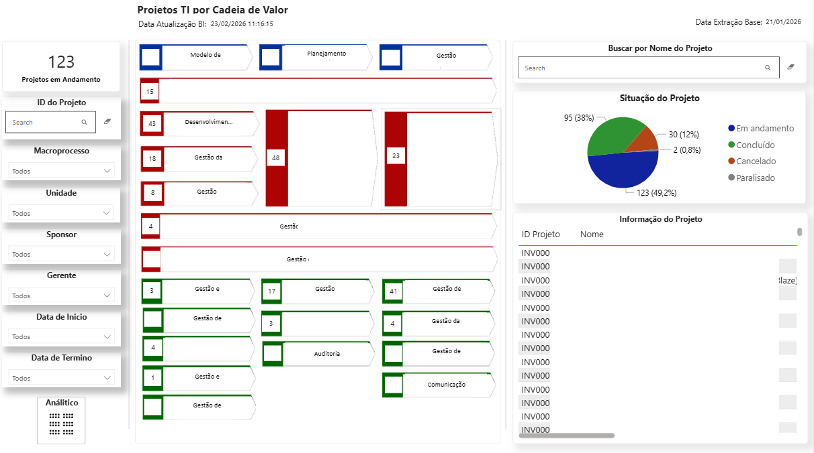

# 📊 Dashboard de Gestão de Projetos de Tecnologia por Cadeia de Valor

## 🎯 Objetivo
Analisar e monitorar os projetos de tecnologia da companhia, vinculando-os ao mapa de processos organizacionais, permitindo identificar a distribuição dos projetos por macroprocesso e acompanhar seu status.

## 🛠 Ferramentas
- Power BI
- Power Query (M)
- DAX
- Base corporativa

## 🧠 Contexto
Projeto desenvolvido com o objetivo de proporcionar uma visão integrada entre os projetos de tecnologia e a cadeia de valor da organização.

O dashboard permite conectar iniciativas de TI aos macroprocessos da empresa, facilitando o acompanhamento estratégico e a tomada de decisão.

Por questões de confidencialidade, os dados apresentados foram adaptados ou mascarados.

## 🔗 Arquitetura e Fontes de Dados
- Base de projetos de tecnologia
- Mapa de processos da organização (macroprocessos)
- Informações de status dos projetos
- Dados de áreas responsáveis e sponsors

## 📊 Principais análises
- Quantidade total de projetos em andamento
- Distribuição de projetos por macroprocesso
- Classificação dos projetos por status:
  - Em andamento
  - Concluído
  - Cancelado
  - Paralisado
- Acompanhamento de projetos por área / unidade / gerente

## 📈 Análises estratégicas
- Visão da cadeia de valor destacando:
  - Macroprocessos com maior concentração de projetos
  - Áreas com maior impacto estratégico
- Identificação de possíveis gaps ou concentração excessiva de iniciativas

## 🧠 Modelagem de dados
Modelo estruturado considerando:
- Fato: Projetos de Tecnologia
- Dimensões:
  - Macroprocesso
  - Unidade
  - Sponsor
  - Gerente

## ⚙️ Transformações (Power Query - M)

= Table.AddColumn(
    #"Tipo Alterado2",
    "Status",
    each 
        if [Situação do Investimento] = "Execução" then "Em andamento"
        else if [Situação do Investimento] = "Mobilização" then "Em andamento"
        else if [Situação do Investimento] = "Rejeição" then "Cancelado"
        else if [Situação do Investimento] = "Rescisão" then "Concluído"
        else if [Situação do Investimento] = "Em espera" then "Paralisado"
        else null
)

## 📷 Imagens

