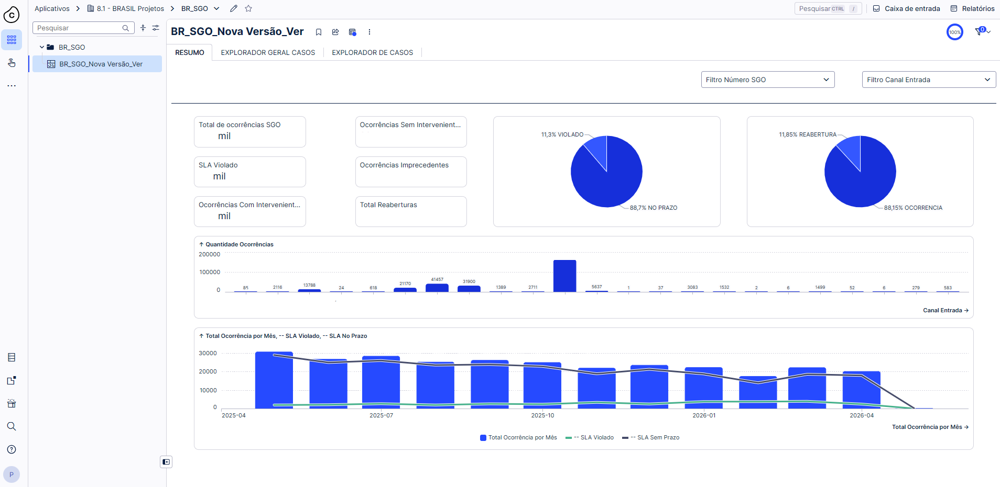
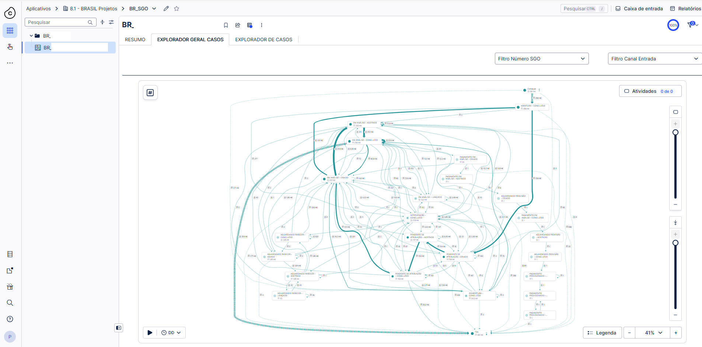

# 🔍 Análise de Processos com Process Mining (Celonis)

## 🎯 Objetivo
Analisar o fluxo de tratamento de ocorrências enviadas para diferentes áreas da empresa a traves de um WorkFlow, com o objetivo de identificar gargalos, retrabalho, desvios de SLA, volume de demandas e conformidade do processo.

## 🛠 Ferramentas
- Celonis (Data Integration, Studio)
- Python (tratamento de dados)
- Arquivos CSV

## 🧠 Contexto
Projeto desenvolvido com base em dados de ocorrências operacionais, estruturados em duas bases principais:

- Base de casos (cases)
- Base de atividades (event log)

O objetivo foi reconstruir o fluxo real do processo, identificar ineficiências operacionais e fornecer insights para melhoria contínua.

Antes da ingestão dos dados no Celonis, foi necessário realizar tratamento e validação das informações para garantir a qualidade da análise.

Por questões de confidencialidade, os dados apresentados foram adaptados ou mascarados.

## 🔗 Arquitetura e Fontes de Dados
- Base de casos contendo os registros das ocorrências
- Base de atividades contendo o histórico de eventos por ocorrência
- Arquivos CSV utilizados como fonte de dados
- Script Python para tratamento e duplicação dos dados

## ⚙️ Preparação de dados (ETL)

Antes da carga no Celonis, foi desenvolvido um script em Python para:

- Identificar ocorrências duplicadas na base de cases
- Manter apenas o registro mais recente (última data de abertura)
- Garantir consistência na chave do processo (Case ID)
- Validar estrutura dos dados para ingestão

## 🧠 Modelagem no Celonis
- Criação do Data Model integrando cases e atividades
- Definição das relações entre tabelas (Case ID)
- Construção do modelo de conhecimento (Knowledge Model)
- Estruturação das métricas e dimensões de análise

## 📊 Principais análises
- Volume total de ocorrências
- Ocorrências com e sem intervenção
- Análise de SLA:
  - Dentro do prazo
  - Fora do prazo (SLA violado)
- Total de reaberturas
- Identificação de ocorrências improcedentes
- Volume por canal de entrada

## 📈 Análises de Process Mining
- Identificação de gargalos no fluxo
- Análise de retrabalho (reabertura de casos)
- Avaliação de conformidade do processo
- Análise de tempo de execução por etapa
- Identificação de variantes do processo

## 🔍 Visão analítica
- Resumo executivo com indicadores principais
- Dashboard de SLA e performance
- Gráficos de volume por canal de entrada
- Evolução de ocorrências ao longo do tempo
- Explorador de processos (Process Explorer)
- Explorador de casos (Case Explorer)

## 🚀 Desafios enfrentados
- Tratamento de dados inconsistentes e duplicados
- Estruturação correta do event log
- Integração entre bases de cases e atividades
- Garantia da qualidade dos dados para análise

## ✅ Soluções aplicadas
- Desenvolvimento de script Python para limpeza e deduplicação
- Estruturação adequada do modelo de dados no Celonis
- Criação de métricas de SLA e performance
- Implementação de dashboards executivos e analíticos

## 🐍 Script de Preparação de Dados (Python)

Para possibilitar a análise no Process Mining, foi desenvolvido um script responsável por:

- Identificar e remover ocorrências duplicadas na base de casos
- Manter apenas o registro mais recente (última data de abertura)
- Garantir unicidade do Case ID
- Padronizar estrutura e nomenclaturas dos dados
- Preparar o formato adequado para ingestão no Celonis

O script pode ser encontrado neste repositório:  
📁 Script_Tratamento_Ocorrencias.ipynb

## 💻 Exemplo do Script

import os
from pathlib import Path
import pandas as pd
import csv

CONFIGURAÇÃO
PASTA = 
ARQUIVO_SAIDA = 
ARQUIVO_LOG = 

COL_DATA = "DATA_ABERTURA"
COL_CHAVE = "NUM_"

FUNÇÕES AUXILIARES
def detectar_delimitador(arquivo, enc="utf-8-sig", amostra_bytes=20000):
    """Tenta detectar delimitador automaticamente (típico: ; , \t)."""
    try:
        with open(arquivo, "r", encoding=enc, errors="ignore") as f:
            sample = f.read(amostra_bytes)
        sniffer = csv.Sniffer()
        dialect = sniffer.sniff(sample, delimiters=[",", ";", "\t", "|"])
        return dialect.delimiter
    except Exception:
        # fallback: tab (muito comum em export de sistemas) ou ;
        return "\t"

## 📷 Imagens

  

