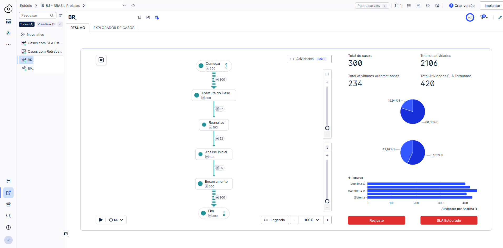
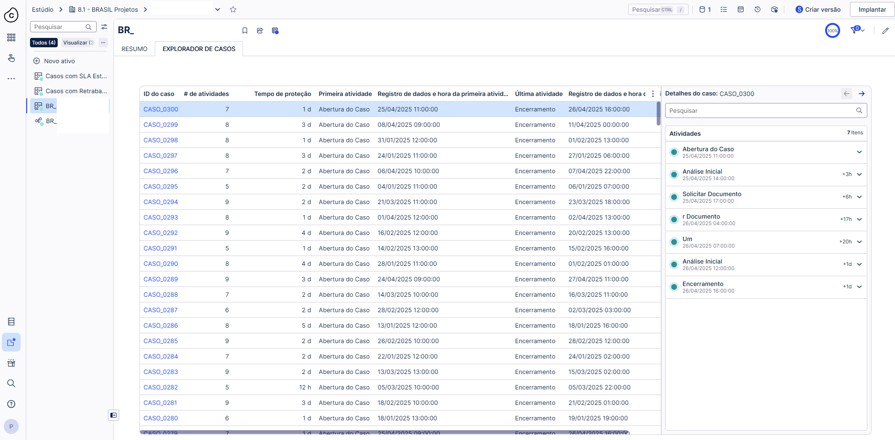

# 🔍 Introdução ao Process Mining (Celonis – Ambiente de Treinamento)

## 🎯 Objetivo
Demonstrar os conceitos de Process Mining utilizando dados fictícios, com o objetivo de apresentar como a ferramenta Celonis permite visualizar processos, identificar gargalos, analisar SLA e avaliar a conformidade das operações.

## 🛠 Ferramentas
- Celonis (Data Integration, Studio)
- Arquivos CSV (dados simulados)

## 🧠 Contexto
Projeto desenvolvido como parte de um treinamento interno, com o objetivo de apresentar o conceito de Process Mining e demonstrar, de forma prática, as capacidades analíticas da ferramenta Celonis.

Foram utilizados dados fictícios para simular um processo operacional completo, permitindo explorar as funcionalidades da plataforma sem exposição de dados sensíveis.

## 🔗 Arquitetura e Dados
- Base de casos (cases) simulando ocorrências
- Base de atividades representando o fluxo do processo
- Estrutura de event log utilizada para reconstrução do processo
- Dados formatados para ingestão no Celonis

## ⚙️ Modelagem no Celonis
- Criação do Data Model com integração entre cases e atividades
- Definição do Case ID como chave principal
- Construção do modelo de conhecimento (Knowledge Model)
- Estruturação das métricas e dimensões para análise

## 📊 Principais análises demonstradas
- Volume total de casos e atividades
- Análise de SLA:
  - Dentro do prazo
  - Fora do prazo
- Total de atividades automatizadas
- Identificação de atividades com maior volume
- Distribuição de atividades por recurso

## 📈 Análises de Process Mining
- Visualização do fluxo real do processo (Process Explorer)
- Identificação de gargalos no fluxo
- Análise de retrabalho (ex: reanálises)
- Avaliação de conformidade do processo
- Identificação de variantes (fluxos alternativos)

## 🔍 Visão analítica
- Dashboard executivo com principais KPIs
- Indicadores de SLA e performance operacional
- Distribuição de atividades por analista/recurso
- Explorador de processos para análise detalhada
- Explorador de casos para análise individual de ocorrências

## 🎓 Objetivo de aprendizado
- Demonstrar como os dados operacionais podem ser transformados em insights de processo
- Apresentar os principais recursos do Celonis
- Evidenciar como identificar oportunidades de melhoria
- Introduzir conceitos de Process Mining aplicados ao negócio

## 🚀 Benefícios demonstrados
- Visibilidade completa do fluxo do processo
- Identificação rápida de gargalos e desvios
- Análise objetiva de SLA
- Melhor entendimento da execução real do processo
- Apoio na tomada de decisão baseada em dados

## 📷 Imagens

  

